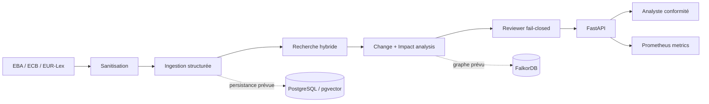

# Regulatory Intelligence Assistant

API d'assistance à l'analyse des changements réglementaires. Le MVP ingère des
textes structurés, recherche des passages avec leurs citations, compare deux
versions d'une réglementation, estime les impacts internes potentiels et bloque
les conclusions dont les sources ne peuvent pas être vérifiées.

> L'application assiste l'analyse. Elle ne fournit pas de conseil juridique et
> ne prend aucune décision de conformité autonome.

Projet de portfolio indépendant construit sur des données synthétiques. Il n'est
ni affilié à BNP Paribas ni utilisé par le Groupe.

## Démonstration

```bash
make demo
```

- interface d'analyse : <http://localhost:8000/demo> ;
- contrats OpenAPI : <http://localhost:8000/docs> ;
- métriques Prometheus : <http://localhost:8000/metrics> ;
- serveur Prometheus : <http://localhost:9090>.

Le bouton **Run complete analysis** exécute réellement les cinq appels API :
ingestion, retrieval, comparaison, revue des citations et analyse d'impact.

## Évaluation reproductible

Le benchmark principal `v2.0.0` est un **challenge set synthétique**, versionné
et déterministe. Il contient 30 documents, 60 requêtes, 120 cas de changement et
60 claims à vérifier, répartis en `train` / `dev` / `test` sans chevauchement de
familles. Les cas difficiles couvrent notamment les négatifs proches, les
reformulations sans termes communs, les changements de seuil ou de délai et les
renumérotations.

Résultats du split de test, avec intervalle de confiance bootstrap à 95 % :

| Mesure | Résultat | IC 95 % | Échantillon |
|---|---:|---:|---:|
| Recall@5 | 75,00 % | 55,00–90,00 % | 20 requêtes |
| Mean Reciprocal Rank | 61,42 % | 41,41–79,17 % | 20 requêtes |
| Changements — précision / rappel / F1 | 100 / 100 / 100 % | F1 100–100 % | 40 cas |
| Classification du reviewer | 100 % | 100–100 % | 20 claims |

```bash
make benchmark-v2
```

Cette commande évalue uniquement le split `test` et produit :

- `artifacts/evaluation-report-v2.json`, rapport canonique exploité par la démo ;
- `artifacts/evaluation-report-v2.md`, résumé lisible avec résultats par difficulté ;
- Recall@5, MRR, précision/rappel/F1, accuracy du reviewer et intervalles de
  confiance bootstrap à graine fixe.

Le rapport inclut la version, le split, le SHA-256 du dataset et le nombre de cas.
Il faut publier ensemble le score **et** la taille du split évalué. Le petit
benchmark `v1.0.0` (6 requêtes, 6 changements et 3 claims) reste un test
d'acceptation historique ; ses scores à 100 % ne constituent pas une preuve de
généralisation.

> Toutes les clauses de `v2.0.0` sont fictives. Elles ne sont ni des citations,
> ni des résumés, ni des interprétations d'EUR-Lex, de l'EBA ou de la BCE. Une
> évaluation sur textes publics annotés par plusieurs humains reste nécessaire
> avant toute affirmation sur une qualité en conditions réelles.

### Évaluation Gemini optionnelle

Gemini intervient uniquement comme juge sémantique **consultatif**. Il ne modifie
jamais les métriques déterministes. Les réponses structurées sont validées par
Pydantic, les appels sont retentés avec un backoff borné et mis en cache par
empreinte SHA-256 afin de limiter coût et variabilité.

Ajoutez votre secret dans `.env` (ce fichier est ignoré par Git) :

```dotenv
GEMINI_API_KEY=votre-cle
```

Puis lancez :

```bash
make benchmark-gemini
```

Mesure obtenue avec `gemini-3.6-flash` sur les 20 requêtes du split test :
groundedness moyen **84,50 %**, correctness **69,00 %**, completeness **69,00 %**
et pass rate consultatif **55,00 %**. Ces scores évaluent le premier passage
retourné comme réponse candidate ; ils ne remplacent ni les labels déterministes
ni une revue humaine.

Le rapport sépare explicitement `groundedness`, `correctness`, `completeness` et
le taux de passage Gemini des scores de référence. La configuration du modèle,
du cache et des tentatives est documentée dans `.env.example`. Références :
[gestion de la clé Gemini](https://ai.google.dev/gemini-api/docs/api-key) et
[sorties structurées](https://ai.google.dev/gemini-api/docs/structured-output).

### Corpus réglementaire officiel

Un pipeline séparé acquiert DORA, RGPD, AI Act, MiCA et CRR depuis le dépôt
Cellar de l'Office des publications, avec identifiants CELEX/ELI, URLs finales,
horodatages, tailles et SHA-256 :

```bash
make public-corpus
```

Les snapshots restent locaux et ne sont pas confondus avec la vérité terrain du
benchmark. Le protocole et la frontière d'annotation sont détaillés dans
[docs/public-corpus.md](docs/public-corpus.md).

## Fonctionnalités

- parsing texte/HTML et découpage par titres, articles et paragraphes ;
- recherche hybride déterministe (BM25 + similarité de tokens) avec seuil de preuve ;
- comparaison `added` / `removed` / `modified` / `unchanged` ;
- détection de changements matériels, notamment `should` → `must` ;
- analyse prudente des politiques et contrôles potentiellement impactés ;
- reviewer fail-closed vérifiant chaque extrait cité dans sa source ;
- masquage d'identifiants et détection de prompt injection dans les documents ;
- benchmark split-aware, métriques hors ligne et intervalles bootstrap ;
- juge Gemini optionnel avec sorties structurées, cache et retries ;
- instrumentation HTTP et exposition Prometheus ;
- persistance PostgreSQL auditable et infrastructure FalkorDB prête à étendre ;
- image Docker non-root et stack Compose avec healthchecks.

## Démarrage avec Docker

```bash
cp .env.example .env
docker compose up --build --detach --wait
curl --fail http://localhost:8000/health
```

Compose démarre quatre services avec healthchecks : API, PostgreSQL/pgvector,
FalkorDB et Prometheus.

## Développement local

Python 3.12 et [uv](https://docs.astral.sh/uv/) sont recommandés.

```bash
uv sync --extra dev
uv run uvicorn app.main:app --reload
uv run pytest
uv run ruff check .
```

## Parcours API minimal

Indexer un passage :

```bash
curl -X POST http://localhost:8000/v1/documents \
  -H 'content-type: application/json' \
  -d '{
    "source": "EBA Guidelines 2026",
    "content": "# Model monitoring\n\nArticle 12.3\n\nInstitutions must review controls annually."
  }'
```

Puis rechercher la preuve :

```bash
curl -X POST http://localhost:8000/v1/search \
  -H 'content-type: application/json' \
  -d '{"query":"annual model monitoring review"}'
```

Une recherche sans passage suffisamment pertinent renvoie explicitement
`insufficient_evidence`. Les autres contrats sont visibles et testables dans
OpenAPI :

| Endpoint | Rôle |
|---|---|
| `POST /v1/documents` | Nettoyer, découper et indexer un document |
| `POST /v1/search` | Retrouver les passages classés et cités |
| `POST /v1/changes/compare` | Comparer deux ensembles de sections |
| `POST /v1/claims/review` | Vérifier les claims d'un changement |
| `POST /v1/impacts/analyze` | Classer les impacts internes potentiels |

## Architecture



Les choix, flux de données, frontières de confiance et limites sont détaillés
dans [docs/architecture.md](docs/architecture.md). Le guide Docker et les
consignes de passage en production sont dans
[docs/deployment.md](docs/deployment.md).

## État et limites du MVP

L'index de recherche exposé par l'API est volontairement en mémoire : son contenu
est perdu au redémarrage. Le schéma PostgreSQL est initialisé dans Compose et les
adaptateurs de persistance sont présents, mais le branchement ingestion → base et
le client FalkorDB restent des évolutions. Les algorithmes déterministes rendent
la démo locale reproductible. Un adaptateur d'embeddings Gemini est disponible
pour des expérimentations hors ligne, mais le retrieval HTTP de référence reste
déterministe tant qu'une comparaison contrôlée ne justifie pas son activation.

Les scores affichés proviennent uniquement du rapport versionné présent dans
`artifacts/` (v2 prioritaire, v1 en repli). Ils doivent être complétés avec un
corpus public annoté avant toute conclusion sur la qualité en production.

## Formulation portfolio recommandée

Claim défendable : « Conception d'une API FastAPI de regulatory intelligence
evidence-grounded, d'un benchmark synthétique split-aware de 240 cas et d'une
stack Docker observée par Prometheus ; évaluation reproductible avec bootstrap
et LLM-as-a-judge consultatif. » Évitez « 100 % de précision sur les textes
réglementaires » tant qu'un corpus public indépendant n'a pas été annoté et testé.
