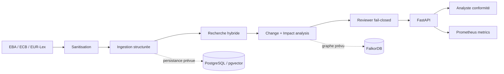

# Regulatory Intelligence Assistant

API d'assistance à l'analyse des changements réglementaires. Le MVP ingère des
textes structurés, recherche des passages avec leurs citations, compare deux
versions d'une réglementation, estime les impacts internes potentiels et bloque
les conclusions dont les sources ne peuvent pas être vérifiées.

> L'application assiste l'analyse. Elle ne fournit pas de conseil juridique et
> ne prend aucune décision de conformité autonome.

Projet de portfolio indépendant construit sur des données synthétiques. Il n'est
ni affilié à BNP Paribas ni utilisé par le Groupe.

## Démonstration

```bash
make demo
```

- interface d'analyse : <http://localhost:8000/demo> ;
- contrats OpenAPI : <http://localhost:8000/docs> ;
- métriques Prometheus : <http://localhost:8000/metrics> ;
- serveur Prometheus : <http://localhost:9090>.

Le bouton **Run complete analysis** exécute réellement les cinq appels API :
ingestion, retrieval, comparaison, revue des citations et analyse d'impact.

## Résultats mesurés

Résultats du benchmark d'acceptation synthétique `v1.0.0`. Ils vérifient le
comportement déterministe du MVP et ne prétendent pas mesurer une généralisation
sur l'ensemble du corpus réglementaire européen.

| Mesure | Résultat | Échantillon |
|---|---:|---:|
| Recall@5 | 100 % | 6 requêtes |
| Mean Reciprocal Rank | 100 % | 6 requêtes |
| Détection de changement — précision / rappel / F1 | 100 / 100 / 100 % | 6 changements |
| Classification du reviewer | 100 % | 3 cas labellisés |
| Tests automatisés | 35 réussis | unitaires + intégration |

Reproduire les chiffres :

```bash
uv run python scripts/run_benchmark.py \
  --output artifacts/evaluation-report.json
```

Le rapport conserve la version et le SHA-256 du jeu de données. Les proportions
de claims et citations supportés sont aussi publiées dans le rapport, séparément
des métriques de performance du reviewer.

## Fonctionnalités

- parsing texte/HTML et découpage par titres, articles et paragraphes ;
- recherche hybride déterministe (BM25 + similarité de tokens) avec seuil de preuve ;
- comparaison `added` / `removed` / `modified` / `unchanged` ;
- détection de changements matériels, notamment `should` → `must` ;
- analyse prudente des politiques et contrôles potentiellement impactés ;
- reviewer fail-closed vérifiant chaque extrait cité dans sa source ;
- masquage d'identifiants et détection de prompt injection dans les documents ;
- métriques hors ligne Recall@K, MRR, précision, rappel et F1 ;
- instrumentation HTTP et exposition Prometheus ;
- persistance PostgreSQL auditable et infrastructure FalkorDB prête à étendre ;
- image Docker non-root et stack Compose avec healthchecks.

## Démarrage avec Docker

```bash
cp .env.example .env
docker compose up --build --detach --wait
curl --fail http://localhost:8000/health
```

Compose démarre quatre services avec healthchecks : API, PostgreSQL/pgvector,
FalkorDB et Prometheus.

## Développement local

Python 3.12 et [uv](https://docs.astral.sh/uv/) sont recommandés.

```bash
uv sync --extra dev
uv run uvicorn app.main:app --reload
uv run pytest
uv run ruff check .
```

## Parcours API minimal

Indexer un passage :

```bash
curl -X POST http://localhost:8000/v1/documents \
  -H 'content-type: application/json' \
  -d '{
    "source": "EBA Guidelines 2026",
    "content": "# Model monitoring\n\nArticle 12.3\n\nInstitutions must review controls annually."
  }'
```

Puis rechercher la preuve :

```bash
curl -X POST http://localhost:8000/v1/search \
  -H 'content-type: application/json' \
  -d '{"query":"annual model monitoring review"}'
```

Une recherche sans passage suffisamment pertinent renvoie explicitement
`insufficient_evidence`. Les autres contrats sont visibles et testables dans
OpenAPI :

| Endpoint | Rôle |
|---|---|
| `POST /v1/documents` | Nettoyer, découper et indexer un document |
| `POST /v1/search` | Retrouver les passages classés et cités |
| `POST /v1/changes/compare` | Comparer deux ensembles de sections |
| `POST /v1/claims/review` | Vérifier les claims d'un changement |
| `POST /v1/impacts/analyze` | Classer les impacts internes potentiels |

## Architecture



Les choix, flux de données, frontières de confiance et limites sont détaillés
dans [docs/architecture.md](docs/architecture.md). Le guide Docker et les
consignes de passage en production sont dans
[docs/deployment.md](docs/deployment.md).

## État et limites du MVP

L'index de recherche exposé par l'API est volontairement en mémoire : son contenu
est perdu au redémarrage. Le schéma PostgreSQL est initialisé dans Compose et les
adaptateurs de persistance sont présents, mais le branchement ingestion → base et
le client FalkorDB restent des évolutions. Les algorithmes déterministes rendent
la démo locale reproductible ; un fournisseur LLM et des embeddings peuvent être
ajoutés derrière les mêmes contrats après évaluation.

Les scores affichés proviennent uniquement du petit benchmark synthétique
versionné. Ils doivent être complétés avec un corpus public annoté avant toute
conclusion sur la qualité en production.
