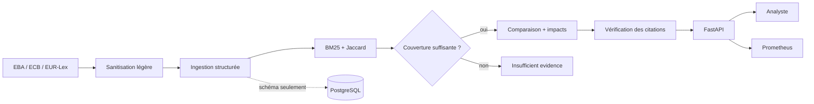

# Regulatory Intelligence Assistant

J’ai construit ce projet pour explorer une question simple : comment aider un
analyste à repérer ce qui a changé entre deux versions d’un texte réglementaire,
sans lui présenter des conclusions impossibles à vérifier ?

L’application ingère des textes structurés, retrouve les passages utiles avec
leur citation, compare deux versions et suggère les politiques ou contrôles qui
pourraient être concernés. Si elle ne trouve pas assez de preuves, elle répond
`insufficient_evidence`.

Ce dépôt est un projet personnel réalisé sur des données synthétiques. Il n’est
ni affilié à BNP Paribas ni utilisé par le Groupe. Il ne fournit pas de conseil
juridique et ne prend aucune décision de conformité à la place d’un humain.

## Essayer la démo

```bash
make demo
```

Une fois les conteneurs démarrés :

- la démo est disponible sur <http://localhost:8000/demo> ;
- la documentation OpenAPI sur <http://localhost:8000/docs> ;
- les métriques de l’API sur <http://localhost:8000/metrics> ;
- Prometheus sur <http://localhost:9090>.

Le bouton **Run complete analysis** ne joue pas une animation préenregistrée :
il appelle réellement les cinq étapes de l’API — ingestion, recherche,
comparaison, vérification des citations et analyse d’impact.

## Ce que fait le projet

- lecture de texte brut ou HTML, puis découpage par titre, article et paragraphe ;
- recherche lexicale en mémoire avec BM25 et similarité de Jaccard ;
- refus d’un résultat si le passage ne couvre pas au moins 60 % des termes utiles
  de la requête ;
- comparaison de sections en `added`, `removed`, `modified` ou `unchanged` ;
- repérage de quelques changements explicites : obligation renforcée, délai ou
  valeur numérique modifiés, ajout ou suppression d’une section ;
- vérification des citations avant d’accepter une affirmation ;
- rapprochement prudent avec une liste de politiques et contrôles internes ;
- métriques Prometheus, image Docker non-root et sondes d’état Compose.

La sanitisation reste volontairement modeste : quelques regex masquent les IBAN
et adresses e-mail, et trois motifs d’injection connus déclenchent un drapeau
consultatif. Ce n’est pas un système complet de détection de données sensibles ou
de prompt injection.

## Comment la recherche décide de répondre

BM25 et Jaccard servent à classer les passages. Ils ne suffisent pas à décider
qu’un passage constitue une preuve : un score normalisé par rapport aux autres
résultats de la même requête peut être élevé même lorsque tout est mauvais.

La décision repose donc sur un critère séparé. Après retrait des mots vides, au
moins 60 % des termes de la requête doivent apparaître dans le passage. Une
requête composée uniquement de mots vides est refusée. Par exemple,
`what is the capital of Mongolia` ne renvoie rien face à un corpus parlant de
capital réglementaire, malgré le mot « capital » en commun.

Ce seuil vient de la configuration `RIA_MINIMUM_QUERY_COVERAGE`. L’API et le
benchmark lisent la même valeur ; le rapport enregistre celle qui a été utilisée.

## Ce que donnent les évaluations

Le benchmark `v2.0.0` est synthétique et déterministe. Il contient 30 documents,
60 requêtes, 120 comparaisons de textes et 60 affirmations, répartis entre `train`,
`dev` et `test`. Les familles ne se chevauchent pas entre les splits, mais les
phrases proviennent encore de gabarits répétés.

Résultats actuels sur le split de test :

| Mesure | Résultat | IC 95 % | Échantillon |
|---|---:|---:|---:|
| Recall@5 | 50,00 % | 30,00–70,00 % | 20 requêtes |
| Mean Reciprocal Rank | 50,00 % | 30,00–70,00 % | 20 requêtes |

L’intervalle est large : 50 % n’est donc pas une estimation solide de la qualité
du moteur, encore moins sur EUR-Lex. Le chiffre est surtout utile pour suivre les
régressions sur ce jeu précis. Sans la garde de couverture, le Recall@5 remonte à
75 %, mais le moteur recommence aussi à accepter des résultats hors sujet. J’ai
préféré le comportement prudent.

Les 40 cas de changement et les 20 cas de vérification passent actuellement.
Je les présente comme des tests de non-régression, pas comme un F1 ou une accuracy
en conditions réelles : les données ont été générées autour des mêmes motifs que
les règles du code.

Pour régénérer les résultats :

```bash
make benchmark-v2
```

La commande produit :

- `artifacts/evaluation-report-v2.json`, utilisé par la démo ;
- `artifacts/evaluation-report-v2.md`, plus agréable à lire.

Le rapport conserve la version du jeu de données, son SHA-256, le split, le seuil
appliqué, la taille des échantillons et les intervalles bootstrap. Le benchmark
`v1.0.0` reste disponible comme ancien test d’acceptation, mais il est trop petit
pour servir de mesure de qualité.

Toutes les clauses de ces jeux de données sont fictives. Une vraie évaluation demanderait
un corpus public annoté indépendamment, idéalement par plusieurs personnes.

### Juge Gemini, en option

Gemini peut relire les réponses comme juge sémantique. Cette étape reste
consultative et ne change jamais les métriques déterministes. Les réponses sont
validées par Pydantic et mises en cache. En cas d’échec, les nouveaux appels sont
espacés progressivement.

```dotenv
GEMINI_API_KEY=votre-cle
```

```bash
make benchmark-gemini
```

Lorsque ce mode est activé, le rapport affiche côte à côte `groundedness`,
`correctness`, `completeness` et le taux de passage. Aucun résultat Gemini n’est
inclus par défaut, puisqu’il dépend d’un service et d’une version de modèle
externes. Voir la documentation officielle sur la
[gestion de la clé](https://ai.google.dev/gemini-api/docs/api-key) et les
[sorties structurées](https://ai.google.dev/gemini-api/docs/structured-output).

### Textes publics

Un script séparé télécharge DORA, le RGPD, l’AI Act, MiCA et CRR depuis le dépôt
Cellar de l’Office des publications. Il conserve les identifiants CELEX/ELI,
l’URL finale, la date de récupération, la taille et le SHA-256 du fichier.

```bash
make public-corpus
```

Ces fichiers restent des sources brutes locales ; ils ne deviennent pas
automatiquement une vérité terrain. Le protocole est décrit dans
[docs/public-corpus.md](docs/public-corpus.md).

## Parcours API minimal

Indexer un passage :

```bash
curl -X POST http://localhost:8000/v1/documents \
  -H 'content-type: application/json' \
  -d '{
    "source": "EBA Guidelines 2026",
    "content": "# Model monitoring\n\nArticle 12.3\n\nInstitutions must review controls annually."
  }'
```

Puis rechercher une preuve :

```bash
curl -X POST http://localhost:8000/v1/search \
  -H 'content-type: application/json' \
  -d '{"query":"annual model monitoring review"}'
```

Les autres routes sont visibles directement dans OpenAPI :

| Endpoint | Rôle |
|---|---|
| `POST /v1/documents` | Nettoyer, découper et indexer un document |
| `POST /v1/search` | Classer les passages et retourner leurs citations |
| `POST /v1/changes/compare` | Comparer deux ensembles de sections |
| `POST /v1/claims/review` | Vérifier les affirmations produites par la comparaison |
| `POST /v1/impacts/analyze` | Chercher les artefacts internes potentiellement touchés |

## Architecture actuelle



Le chemin utilisé par l’API reste entièrement en mémoire. PostgreSQL est lancé
par Compose et son schéma peut être créé au démarrage, mais aucun document n’y
est encore enregistré. Il n’y a ni pgvector ni base graphe dans la stack.

Un adaptateur d’embeddings Gemini existe pour les expériences hors ligne. Il est
chargé uniquement lorsqu’il est demandé et n’intervient pas dans `/v1/search`.

Pour les choix d’architecture et les limites de confiance, voir
[docs/architecture.md](docs/architecture.md). Les détails de déploiement sont
dans [docs/deployment.md](docs/deployment.md).

## Lancer la stack Docker

```bash
cp .env.example .env
docker compose up --build --detach --wait
curl --fail http://localhost:8000/health
```

Compose lance trois services : l’API, PostgreSQL et Prometheus.

## Développer en local

Le projet utilise Python 3.12 et [uv](https://docs.astral.sh/uv/).

```bash
uv sync --extra dev
uv run uvicorn app.main:app --reload
uv run pytest
uv run ruff check .
```

## Limites connues

- l’index disparaît au redémarrage de l’API ;
- les couches d’accès PostgreSQL existent, mais ne sont pas reliées aux routes ;
- la recherche est lexicale : les paraphrases éloignées sont souvent refusées ;
- les règles de changement couvrent quelques motifs explicites, pas toute la
  variété d’un texte réglementaire ;
- la sanitisation par regex reste très partielle ;
- les résultats d’évaluation viennent d’un petit jeu de données synthétique.

Ces limites sont assumées dans le MVP. Les prochaines étapes utiles seraient de
brancher réellement la persistance, constituer un jeu annoté sur des textes
publics et comparer proprement la recherche lexicale à une approche sémantique.
