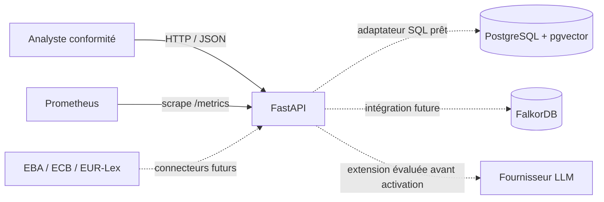
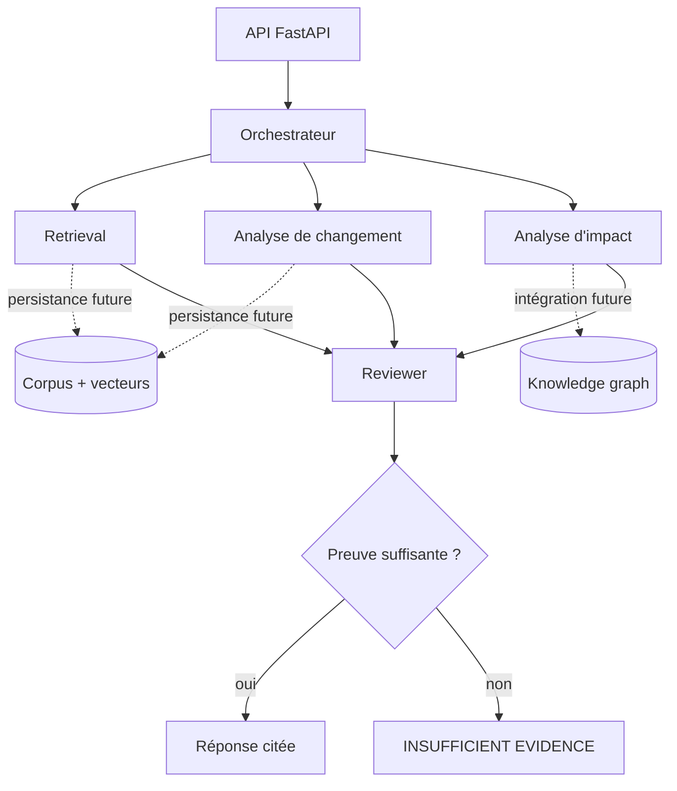
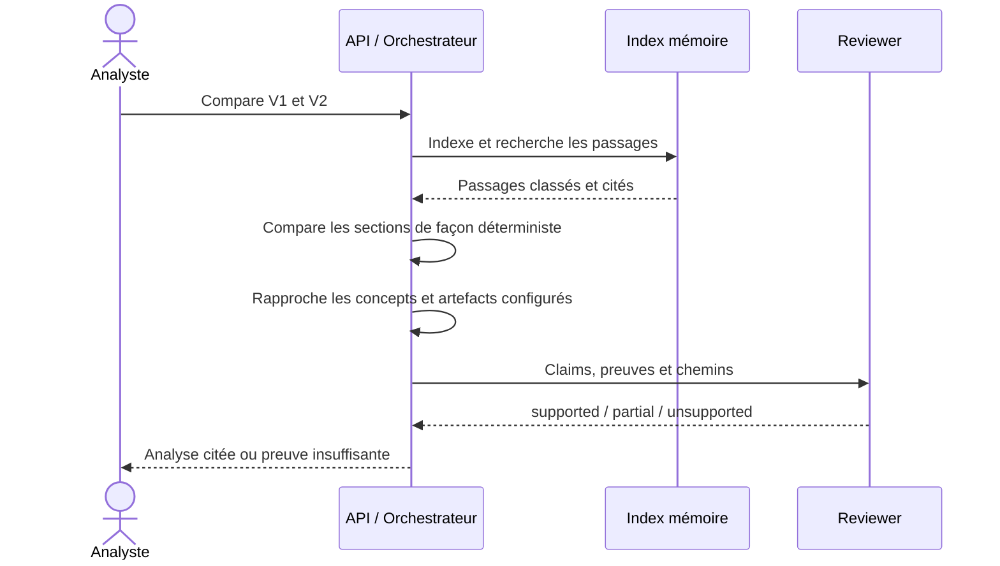

# Architecture

## Objectif et principes

Regulatory Intelligence Assistant aide un analyste à détecter un changement
réglementaire, à retrouver les politiques et contrôles potentiellement concernés,
puis à produire une analyse sourcée. Il s'agit d'un outil d'aide à la décision :
il ne rend pas d'avis juridique et ne prend aucune décision de conformité.

Les principes structurants sont les suivants :

- aucune conclusion importante sans preuve traçable ;
- le contenu documentaire est traité comme une donnée non fiable, jamais comme
  une instruction adressée au modèle ;
- les impacts sont qualifiés de potentiels jusqu'à validation humaine ;
- PostgreSQL/pgvector et FalkorDB sont provisionnés comme trajectoire de
  persistance ; le chemin HTTP courant reste déterministe et en mémoire ;
- les composants spécialisés restent orchestrés et vérifiés plutôt que de former
  une chaîne d'agents autonomes sans contrôle.

## Vue conteneurs du MVP

Le déploiement Docker local fournit quatre services : `api`, `postgres`,
`falkordb` et `prometheus`. L'endpoint `GET /health` est une sonde de vivacité de
l'API ; `/metrics` fournit les compteurs et histogrammes HTTP. La sonde de
vivacité ne constitue pas encore une readiness complète des bases.

## Composants applicatifs cibles

| Composant | Responsabilité | État |
|---|---|---|
| API | Contrats HTTP versionnés, validation, cycle de vie | Implémenté |
| Ingestion | Parsing texte/HTML, métadonnées, chunking structurel | Implémenté |
| Retrieval | BM25, similarité de tokens, seuil de preuve | Implémenté en mémoire |
| Change analysis | Alignement, classification, matérialité déterministe | Implémenté |
| Impact analysis | Rapprochement prudent par concepts configurés | Implémenté |
| Reviewer | Vérification exacte claim → source, politique fail-closed | Implémenté |
| PostgreSQL/pgvector | Documents, sections, métadonnées, audit | Schéma et adaptateur prêts |
| FalkorDB | Relations réglementaires et internes | Infrastructure prête |

## Flux principal

L'ingestion conserve l'identité du document, sa version, l'article, la section,
la page et le passage d'origine. Une citation renvoie à ces éléments immuables ;
un embedding ou une réponse générée ne remplace jamais la source.

## Décisions d'architecture

### Deux stockages spécialisés

Le texte, ses métadonnées et ses vecteurs ont un modèle relationnel naturel et
bénéficient des transactions de PostgreSQL. Les dépendances entre exigences,
politiques, contrôles, processus et équipes se parcourent plus naturellement dans
un graphe. Le coût opérationnel de deux bases est accepté afin d'éviter de forcer
un seul modèle de données à servir deux usages différents.

### Orchestration explicite

Les composants Retrieval, Change, Impact et Reviewer ont des entrées/sorties
structurées. L'orchestrateur garde le contrôle du flux, des délais, des budgets et
des erreurs. Cette approche rend les décisions testables et auditables.

### Refus fondé sur le niveau de preuve

Le seuil de retrieval est configurable. En dessous du seuil, ou lorsqu'un claim
n'est pas soutenu par son passage, la réponse doit expliciter l'insuffisance de
preuve. La confiance du modèle n'est pas assimilée à une probabilité juridique.

### Déploiement reproductible

L'API est construite en image multi-stage et exécutée par un utilisateur non-root.
Compose initialise les dépendances, attend leurs healthchecks et conserve les
données dans des volumes nommés.

## Sécurité et gouvernance

- Authentification et RBAC doivent précéder l'exposition à plusieurs profils.
- Les documents récupérés sont délimités et neutralisés contre la prompt injection.
- Les secrets ne sont ni placés dans l'image ni versionnés ; ils proviennent de
  l'environnement ou, en production, d'un gestionnaire de secrets.
- Les données personnelles doivent être détectées et masquées avant tout appel à
  un fournisseur LLM externe.
- Le journal d'audit doit inclure utilisateur, requête, passages récupérés,
  versions de prompt et de modèle, réponse, citations et décision humaine.
- Les communications inter-services doivent être chiffrées et authentifiées en
  production. Les ports de base exposés par Compose servent uniquement au
  développement local.
- Les rétentions, sauvegardes, restaurations et suppressions doivent suivre la
  classification des données de l'organisation.

## Limites actuelles

- Le socle expose une vivacité, sans readiness applicative des bases.
- FalkorDB est démarré mais son client n'est pas encore intégré à l'API.
- L'image FalkorDB utilise le tag `latest` pour le MVP local ; un digest immuable
  doit être fixé avant une mise en production.
- Compose fournit un environnement mono-hôte sans TLS, haute disponibilité,
  sauvegarde automatisée ni rotation de secrets.
- L'index HTTP est en mémoire et doit être branché à PostgreSQL/pgvector pour
  survivre aux redémarrages et permettre plusieurs réplicas.
- L'analyse actuelle est déterministe et explicable ; l'intégration d'embeddings,
  d'un reranker et d'un LLM reste à mesurer avant activation.
- L'interface dédiée exécute le scénario de démonstration mais n'implémente ni
  authentification ni gestion documentaire complète.
- Les métriques actuelles viennent d'un petit benchmark synthétique versionné ;
  elles ne démontrent pas une généralisation sur des réglementations réelles.
