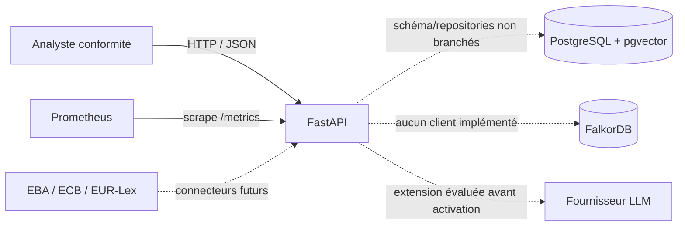
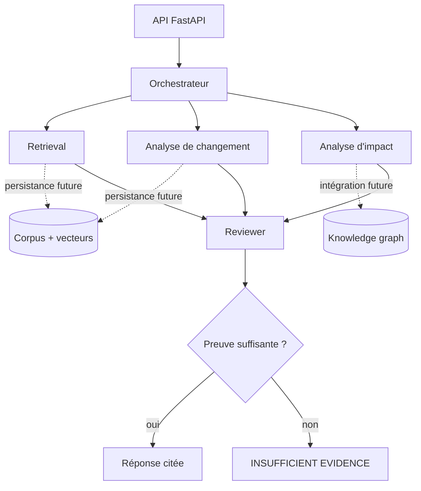
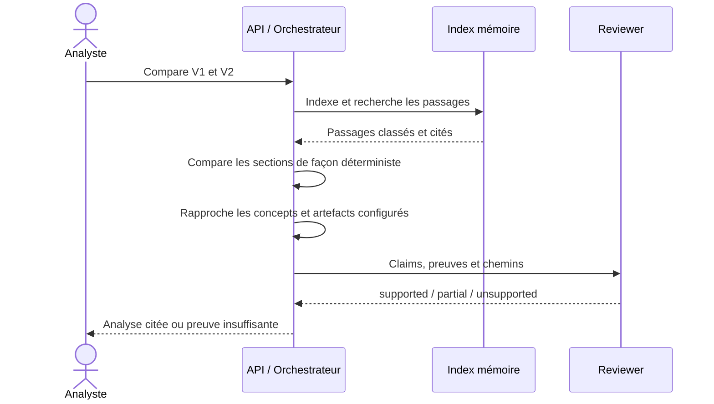

# Architecture

## Objectif et principes

Regulatory Intelligence Assistant aide un analyste à détecter un changement
réglementaire, à retrouver les politiques et contrôles potentiellement concernés,
puis à produire une analyse sourcée. Il s'agit d'un outil d'aide à la décision :
il ne rend pas d'avis juridique et ne prend aucune décision de conformité.

Les principes structurants sont les suivants :

- aucune conclusion importante sans preuve traçable ;
- le contenu documentaire est traité comme une donnée non fiable, jamais comme
  une instruction adressée au modèle ;
- les impacts sont qualifiés de potentiels jusqu'à validation humaine ;
- PostgreSQL avec l'extension pgvector et FalkorDB sont seulement provisionnés
  par Compose ; le chemin HTTP ne lit ni n'écrit ces services ;
- les composants spécialisés restent orchestrés et vérifiés plutôt que de former
  une chaîne d'agents autonomes sans contrôle.

## Vue conteneurs du MVP

Le déploiement Docker local fournit quatre services : `api`, `postgres`,
`falkordb` et `prometheus`. L'endpoint `GET /health` est une sonde de vivacité de
l'API ; `/metrics` fournit les compteurs et histogrammes HTTP. La sonde de
vivacité ne constitue pas encore une readiness complète des bases.

## Composants applicatifs cibles

| Composant | Responsabilité | État |
|---|---|---|
| API | Contrats HTTP versionnés, validation, cycle de vie | Implémenté |
| Ingestion | Parsing texte/HTML, métadonnées, chunking structurel | Implémenté |
| Retrieval | BM25, similarité de tokens, seuil de preuve | Implémenté en mémoire |
| Change analysis | Alignement, classification, matérialité déterministe | Implémenté |
| Impact analysis | Rapprochement prudent par concepts configurés | Implémenté |
| Reviewer | Vérification exacte claim → source, politique fail-closed | Implémenté |
| PostgreSQL/pgvector | Persistance envisagée | Schéma/repositories présents, hors chemin HTTP |
| FalkorDB | Graphe envisagé | Conteneur seulement, aucun client applicatif |

## Flux principal

L'ingestion conserve l'identité du document, sa version, l'article, la section,
la page et le passage d'origine. Une citation renvoie à ces éléments immuables ;
un embedding ou une réponse générée ne remplace jamais la source.

## Décisions d'architecture

### Deux stockages envisagés, non intégrés

PostgreSQL/pgvector et FalkorDB représentent une trajectoire d'architecture, pas
une capacité actuelle. Leur intérêt devra être confirmé par une intégration et
une évaluation avant de pouvoir être revendiqué : le service de recherche actuel
combine uniquement BM25 et Jaccard en mémoire.

### Orchestration explicite

Les composants Retrieval, Change, Impact et Reviewer ont des entrées/sorties
structurées. L'orchestrateur garde le contrôle du flux, des délais, des budgets et
des erreurs. Cette approche rend les décisions testables et auditables.

### Refus fondé sur le niveau de preuve

Le seuil de retrieval est configurable. En dessous du seuil, ou lorsqu'un claim
n'est pas soutenu par son passage, la réponse doit expliciter l'insuffisance de
preuve. La confiance du modèle n'est pas assimilée à une probabilité juridique.

### Déploiement reproductible

L'API est construite en image multi-stage et exécutée par un utilisateur non-root.
Compose initialise les dépendances, attend leurs healthchecks et conserve les
données dans des volumes nommés.

## Sécurité et gouvernance

- Authentification et RBAC doivent précéder l'exposition à plusieurs profils.
- Les documents récupérés sont délimités et neutralisés contre la prompt injection.
- Les secrets ne sont ni placés dans l'image ni versionnés ; ils proviennent de
  l'environnement ou, en production, d'un gestionnaire de secrets.
- Les données personnelles doivent être détectées et masquées avant tout appel à
  un fournisseur LLM externe.
- Le journal d'audit doit inclure utilisateur, requête, passages récupérés,
  versions de prompt et de modèle, réponse, citations et décision humaine.
- Les communications inter-services doivent être chiffrées et authentifiées en
  production. Les ports de base exposés par Compose servent uniquement au
  développement local.
- Les rétentions, sauvegardes, restaurations et suppressions doivent suivre la
  classification des données de l'organisation.

## Limites actuelles

- Le socle expose une vivacité, sans readiness applicative des bases.
- FalkorDB est démarré mais son client n'est pas encore intégré à l'API.
- L'image FalkorDB utilise le tag `latest` pour le MVP local ; un digest immuable
  doit être fixé avant une mise en production.
- Compose fournit un environnement mono-hôte sans TLS, haute disponibilité,
  sauvegarde automatisée ni rotation de secrets.
- L'index HTTP est en mémoire. L'extension pgvector est installée dans le
  conteneur PostgreSQL, mais aucun embedding n'y est stocké ou recherché.
- L'analyse HTTP actuelle reste déterministe et explicable. Les adaptateurs
  Gemini (embeddings et juge structuré) sont confinés à l'évaluation hors ligne ;
  leur activation en production nécessiterait une comparaison contrôlée, une
  revue sécurité et une politique de traitement des données.
- L'interface dédiée exécute le scénario de démonstration mais n'implémente ni
  authentification ni gestion documentaire complète.
- Le challenge set v2 augmente la couverture synthétique avec des splits
  disjoints et des intervalles bootstrap. Il ne démontre toujours pas une
  généralisation sur des réglementations réelles ; cette affirmation exige un
  corpus public indépendant et une vérité terrain multi-annotateurs.
